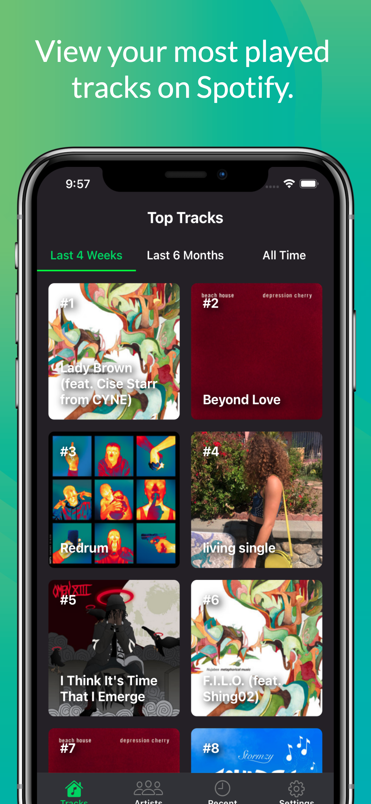

# Statify

## Why did I make this 

Ever wonder what type of music you enjoy? Want to see who's the biggest Drake fan in your circle? Well with Statify you can find out by comparing with your friends.

## How does Statify 

By linking your Spotify account to the Statify App, you will be able to view your most listened to tracks and artists in the past 4 weeks, past 6 months, and your most listened to artists since you've had your Spotify account. You can also view up to 50 of the tracks you've listened to recently.

## What does Statify look and feel 

Below this I have attached some images to give you a feeling for the look and feel for Statify.

 
 
 
 
 

